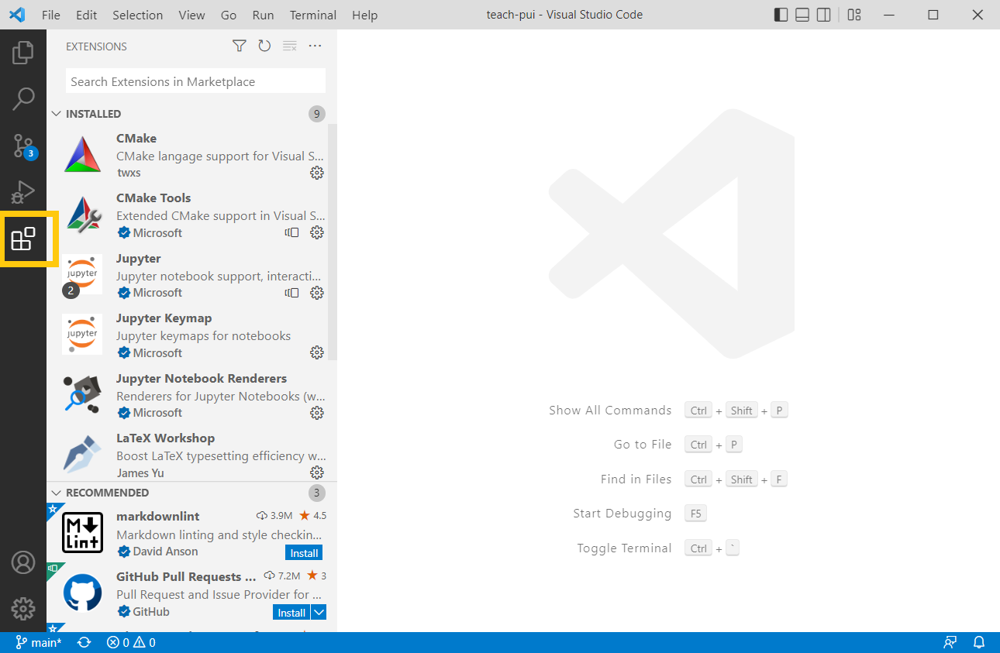
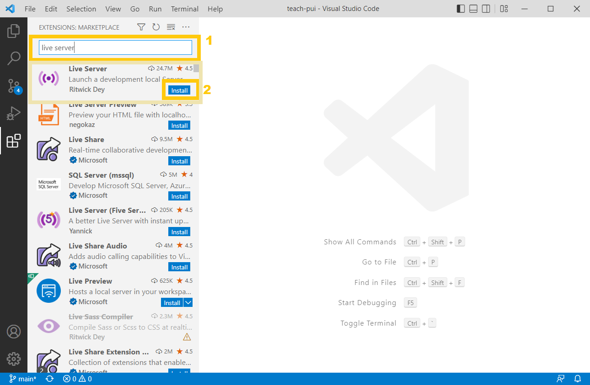
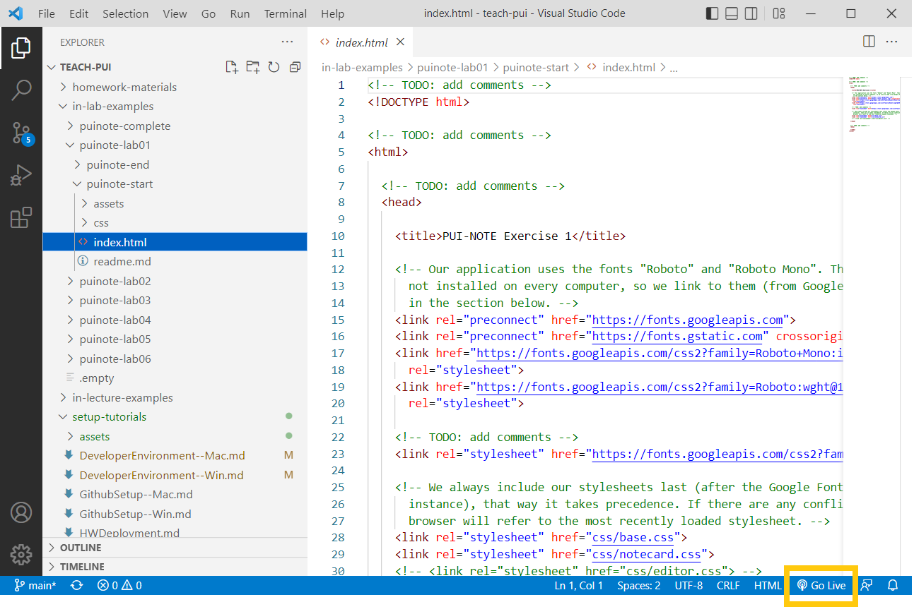
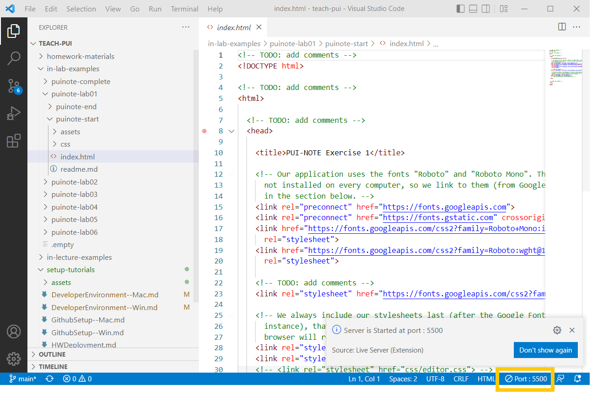
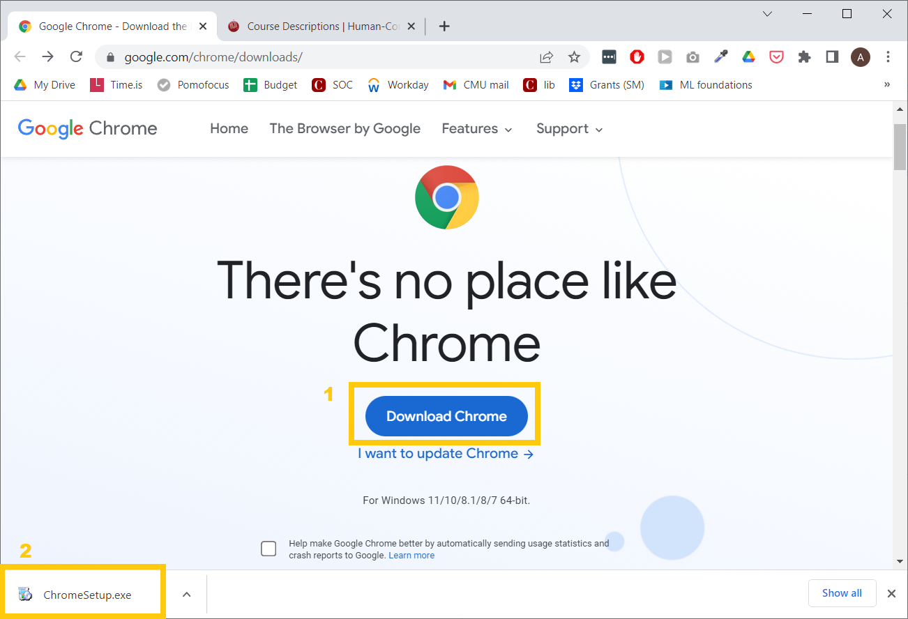
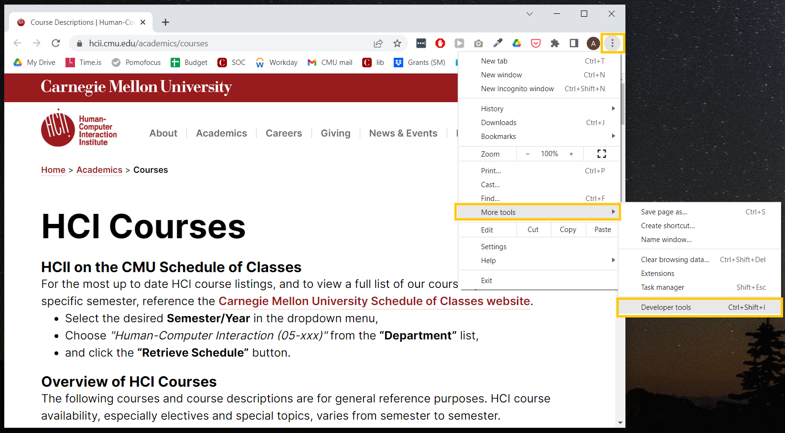
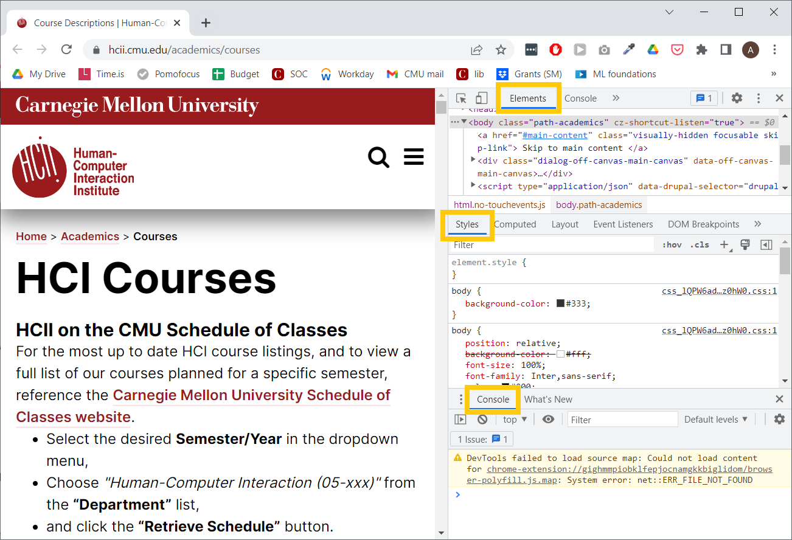

# Developer Environment setup on WIN

_If you're using a Mac computer, you might want to refer to our [Mac tutorial](./DeveloperEnvironment--Mac.md) instead!_

There are a ton of different tools out there to help developers write and test their code. To keep things simple for you and make it easier for us to help you debug, we highly recommend using these tools for the class:

- Visual Studio Code (for writing code)
- Live Server Extension (for locally running your page so you can view it in Chrome)
- Google Chrome (for viewing and testing your pages)
- Chrome Developer Tools (for interactive debugging)

Below you'll find install instructions for the tools listed above.

## Visual Studio Code

The installation for VS Code is super simple and similar to installing Chrome and GitHub Desktop. 
1. Go to the [VS Code homepage](https://code.visualstudio.com/) 
2. Click **Download For Windows**
3. Click the EXE file to open it 
4. Install by stepping through the wizzard. You can keep the default settings.

## Live Server Extension

One of the nice things about VS Code is that it's very customizable, and you can install **extensions** to add new functionality. There's a ton of extensions to choose from, and you might be interested to check out curated lists of helpful extensions like [this one](https://www.sitepoint.com/vs-code-extensions-javascript-developers/). But for now, we only really need one extension: the **Live Server**.

Why do we need Live Server? Well, as you know, the pages we'll build in this class are going to be loaded up and run in the user's browser. And the browser needs to fetch the page contents from somewhere, which is usually a machine on the network called a _server_. When you submit your assignments, the server will be GitHub - but when you're building the app on your local computer, you'll need something that acts like a server but runs locally. And that's exactly what Live Server is.

### Installing Live Server
Open VS Code and click the building blocks icon in the sidebar on the left of the VS Code window (fifth from the top). You'll see a list of extensions you can install, like this:

To install the extension, simply search for "Live Server" in the Extensions sidebar, and hit Install:

### Using Live Server

So, how does it work? Well, let's say you've written some code for a webpage, like the [example repository](https://github.com/interactive-structures/teach-pui-example) we've given you to model your assignments on.

Now that you've installed Live Server, you'll notice a Go Live button in the bottom right corner of the screen. If you click that button, it will start a "server" that opens a new page in your browser running your code. Easy as that!

What's even cooler is that you can change your code in VS Code, and when you **save** the files, the page in your browser will **automatically reload** so you can see the new page immediately.

To stop the Live Server, simply click the Stop icon where the Go Live button originally was:

---

With that, you should be able to edit code, run a Live Server, see your code run in Google Chrome, and inspect it with the Developer Tools. Happy coding!

## Google Chrome

Please test your website using Google Chrome. We will too. If you don't have Chrome installed, here are the steps: 

1. Go to [chrome.google.com](https://www.google.com/chrome/downloads/) and click the **Download Chrome** button.

2. Open the EXE file from the Downloads list, and install Chrome on your computer.

3. Open Chrome from your Applications list, and you should be all set!

## Chrome Developer Tools

Great news - you don't need to install this! It comes built-in to Google Chrome.

For example, try opening the [HCII course page](https://www.hcii.cmu.edu/academics/courses). Now go to **More tools > Developer Tools**. 

You should see the Chrome Developer Tools pane pop up on the right of the screen ike this:

The most important panels for you will be:
- Elements: shows HTML
- Styles: shows CSS
- Console: you can output information from your JavaScript code, which is very helpful for debugging.

Note that you can arrange the panels as you like best, they may show up differently for you. Also, **you can change the page interactively by changing the HTML or CSS directly in the Chrome DevTools.**

For example, the top panel shows "Elements", which is an interactive depiction of the HTML in the page. When you expand different parts of the HTML code and hover over them, you'll see the part of the page highlighted that the code corresponds to.

> What if you want to find the source code for a particular element? A handy trick is to right-click (or Control+click) on any part of the webpage itself, then click **Inspect**. That will jump the Elements panel directly to the HTML that defined that particular element. Pretty cool, right?

The Developer Tools have a ton of useful features. There's detailed documentation on all of its features [here](https://developer.chrome.com/docs/devtools/), which you might find useful along your web dev journey.